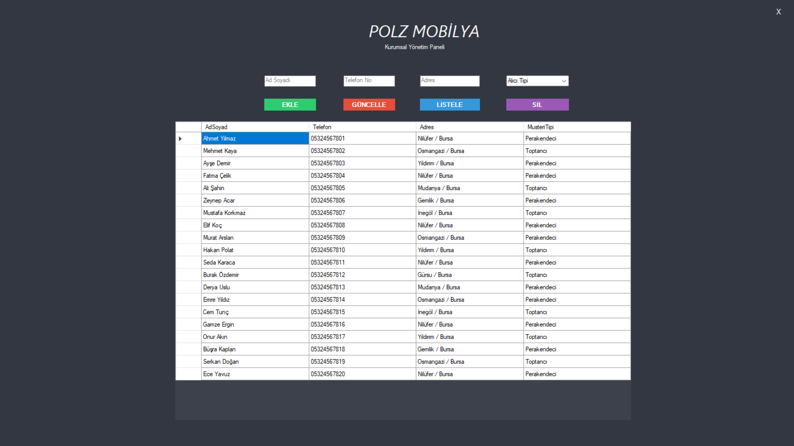
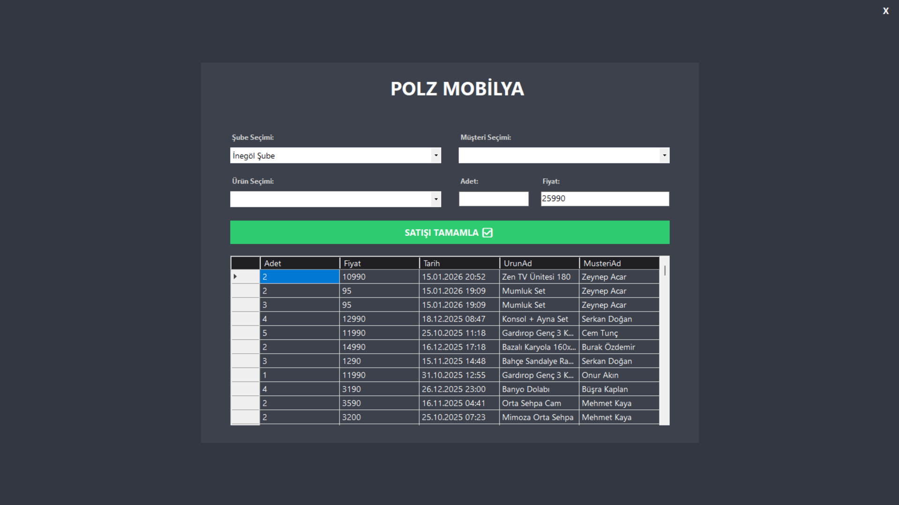

# Polz Mobilya Satış - Stok Takip Sistemi

Bu proje, **C# WinForms** ve **MySQL** kullanılarak geliştirilmiş,
bir mobilya firmasının **stok, satış, müşteri ve raporlama süreçlerini**
yönetmek amacıyla hazırlanmış bir masaüstü uygulamasıdır.

Proje, **katmanlı mimari** yaklaşımıyla geliştirilmiş olup,
gerçek bir işletme senaryosu baz alınarak tasarlanmıştır.

---

## Kullanılan Teknolojiler
- C# (.NET WinForms)
- MySQL
- MySql.Data
- Katmanlı Mimari (UI – Business – DataAccess – Entity)
- Grafik ve Raporlama (Chart)

---

## Uygulama Özellikleri
- Ürün yönetimi (ekleme, listeleme, güncelleme)
- Müşteri yönetimi
- Satış işlemleri
- Şube bazlı satış takibi
- Stok kontrolü
- Dashboard üzerinden özet bilgiler
- Grafik ve raporlama ekranları

---

## Proje Klasör Yapısı
```
database/    → MySQL veritabanı SQL dosyası  
screenshots/ → Uygulama ekran görüntüleri  
src/         → Visual Studio proje dosyaları ve kaynak kodlar  
```

---

##  Ekran Görüntüleri
> Not: Aşağıdaki görsel adları `screenshots/` klasöründeki dosya adlarıyla birebir aynı olmalıdır.

### Giriş Ekranı


### Dashboard


### Finansal Raporlar


### Satış & Ciro Raporları


### Stok & Üretim Raporları


### Müşteri Raporları


### Müşteriler


### Satışlar


### Ürün Yönetimi


---

## Kurulum ve Çalıştırma

### 1️⃣ Veritabanı Kurulumu (phpMyAdmin)
1. phpMyAdmin’e giriş yapın
2. Yeni bir veritabanı oluşturun (örnek: `stok_satis_db`)
3. Üst menüden **Import / İçe Aktar** bölümüne girin
4. `database/stok_satis.sql` dosyasını seçin
5. **Go / Git** butonu ile içe aktarın
6. Tabloların başarıyla oluşturulduğunu kontrol edin

---

### 2️⃣ Connection String Ayarı
- `src` klasörü içerisindeki projede **App.config** dosyasını açın
- MySQL bağlantı bilgilerini kendi sisteminize göre güncelleyin

Örnek:
```
server=localhost;
database=stok_satis_db;
uid=root;
password=;
```

---

### 3️⃣ Uygulamayı Çalıştırma
- `src/PolzMobilyaSatisStokTakip.sln` dosyasını Visual Studio ile açın
- Projeyi **Start** ederek uygulamayı çalıştırın

---

## 🎯 Projenin Amacı
Bu proje; **Nesne Yönelimli Programlama**, **veritabanı işlemleri** ve
**katmanlı mimari** kavramlarının uygulanmasını göstermek amacıyla
akademik bir çalışma (final projesi) olarak geliştirilmiştir.

---

## Geliştirici
**Azad Çam**  
Uludağ Üniversitesi – Yönetim Bilişim Sistemleri
